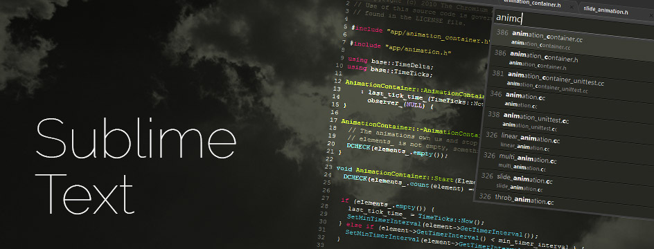
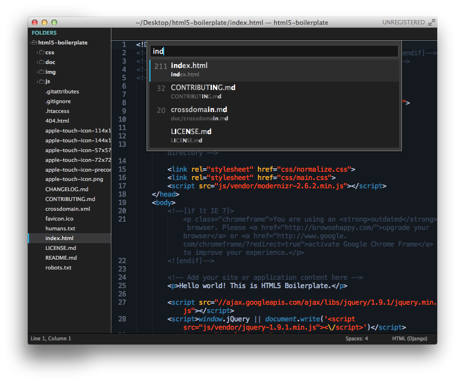
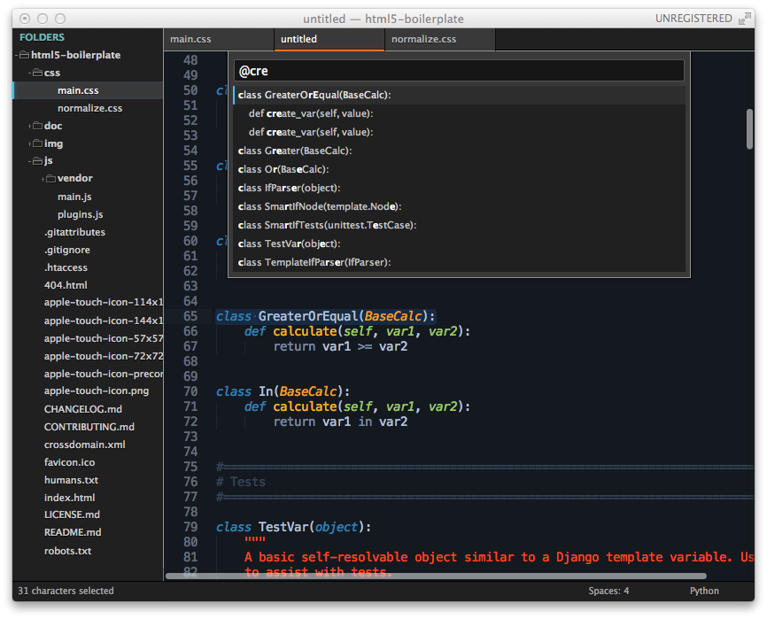
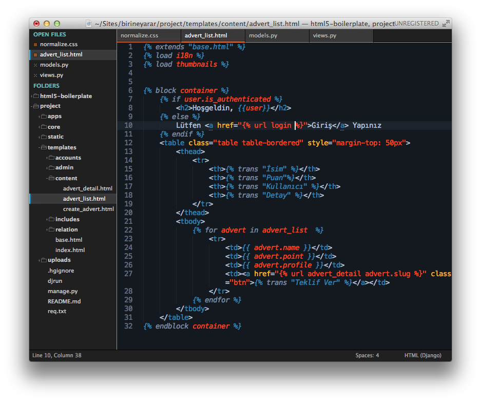
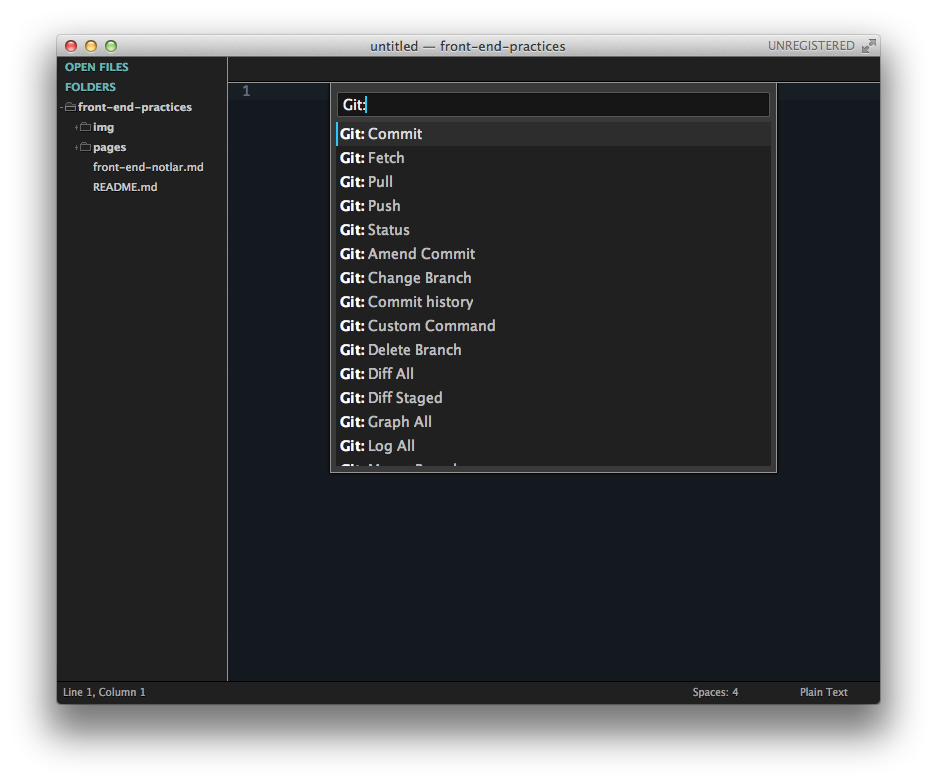
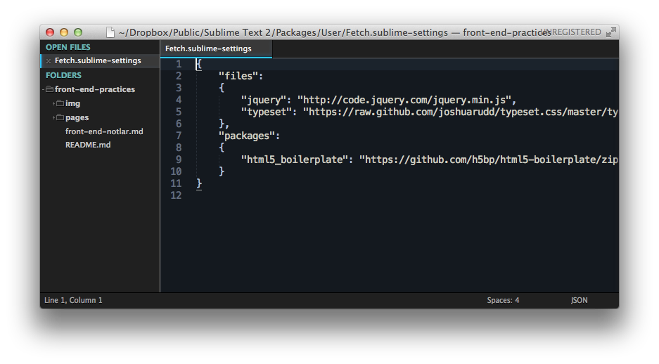

Title: Sublime Text
Date: 2012-03-01 01:22
Tags: sublime text, text editor
Category: Writings
Slug: sublime-text
Author: ekinertac

Text editörler, IDE'ler... uğruna internette forumlarda, ofiste arkadaşlarımızla tartıştığımız, üstüne gül koklamadığımız editörler. Herkesin kullandığı editör kendisine göre en iyisi, ondan daha iyisi **yok**. **Olamazda** zaten, en iyi editör herzaman en iyi, en etkili şekilde **kullanabildiğiniz** editördür.

Kullanabildiğiniz diyorum çünkü editörün **core** özelliklerini kullanabilmekte bir marifet, sadece kod yazıp save ediyorsanız zaten farketmez hangi editörü kullandığınız, notepad.exe bile işinizi görür, gık demezsiniz. Yazının buradan sonraki bölümü bu tarzdaki kullanıcıları çok **ilgilendirmiyor** zaten.

Birde editörün core özelliklerini zaten halihazırda kullanan, onlar ile yetinmeyip plugin üstüne plugin kuran, gün be gün yeni update varmı diye kontrol eden bir tayfa varki onlar bu yazının odak noktası. **Kedi canını yediklerim.**

Bu tayfa içerisine girince olaylar değişiyor. İşin içine giren editör sayısı yüzlercesinden 5'e 6'ya düşüyor. Hangi editörler bu işin içinde tam olarak kesitmek zor ama `vim`, `emacs`, `Text Mate` ve `Sublime Text` başı çekenler arasında. Bunlar içinde `Text Mate` diğerlerine göre biraz daha zayıf kalıyor çünkü cross platform değil sadece MacOs altında çalışıyor.

Vim ve Emacs ömürlük editörler ister terminalde ister kendi GUI leri ile kullanabiliyorsunuz, istemeyeceğiniz kadar plugini var. Emacs içerisinden jabber ile entegre edip chat yapabilen insanlar [gördüm](http://ozansener.com), yok değil.

Sublime Text de bu ömürlük editörler arasına girmek üzere diyebilirim, zibil gibi plugini, cross platform olmasıyla diğer rakiplerinin çok önüne çıkıyor. **Dreamweaver, Coda** gibi amatörlüğe iten, **'janjanlı'** arayüzleriyle göz boyayan, ücretleriyle can sıkan editörlerden bahsetmek bile istemiyorum zaten.

**Sublime Text**'de ücretli bir editör ama lisansını satın almadığınız durumda ne bir özellik kısıtlanıyor, nede belirli bir süre boyunca kullanabiliyorsunuz. Sadece günde belki bir veya iki kere çıkan bir confirm box ile sizi rahatsız ediyor editörümüz. Ondada `esc`'e basınca gidiyor zaten . Çok sıkıntı veren bir durum yok ortada.

Sublime Text'i kurduktan sonra biraz şaşırıyoruz 'bu ne ?' diye. O zamanlarıda hatırlıyorum, ne bir menüsü var ne bir button var, bomboş bir editör ama herşey (under the hood) kaportanın altına saklanmış durumda. Klavyeden `Cmd/Ctrl + Shift + p` yaptığınızda birden işler değişiyor, o bomboş arayüzün altında onlarca özellik olduğunu kim bilebilirdi ki ?

Sublime Text açıldıktan sonra, halihazırda içinde kodların olduğu bir klasörü üzerine sürükleyip bırkıyoruz ve sol tarafta 'FOLDERS' adında bir panel açılıyor. Burası sublime'ın **SideBar**'ı. Klasöre tıkaldığımız da alt klasörleri ve içerisindeki dosyaları görebiliyoruz.

###Go to...
Yukarıdaki menüden Goto kısmına gittiğinizde birkaç özellik görüyorsunuz bunlardan bazılarını günlük işlerinizde sürekli kullanacaksınız, bazılarınıda belki hiç kullanmayacaksınız.

####Goto Anything
Goto Anything'e menüden `Goto > Goto Anything...` sekmesinden ulaşılabildiği gibi klavyeden `Cmd/Ctrl + P` veya `Cmd/Ctrl + T` ye basarak de ulaşabiliyoruz. Goto Anything bize bulunduğumuz proje içerisindeki herhangi bir dosyaya ulaşmamızı sağlıyor. Sadece dosya adının birkaç harfini yazmamız yeterli.

>Sublime'ın bu panelden açılan menülerinde bir güzellik var aradığınız şeyin tam adını veya ilk bir kaç harfini yazmak zorunda değilsiniz, diyelimki `CodeClassTextSelector` diye bir class arıyorsunuz arama kutusuna `ccts` gibi birşeyler yazmanız onu bulabilmeniz için yeterli oluyor.

####Goto Symbol
Goto Symbol özelliğide anything özelliği kadar kullanışlı, editörde açık olan dosyadaki  fonksiyonları, classları, idleri kısaca tüm keywordleri yakalayıp size getiren bir özellik. `Cmd/Ctrl + R` kısayoluyla açtığınız panelde `cre` yazıyorum ve bana `cre` ile başlıyan tüm fonksiyon veya class'ları bulup getiriyor.

####Goto Line
Goto Line özelliği de öncekilere benzeyen bir özellik, `kntrl/Ctrl + G` kısayoluyla çalışıyor ve sizi istediğiniz satır numarasına götürüyor.

### Multiple Select
Sublime'dan önceki editörlerde varmıydı bilmiyorum ama ben multi select olayını ilk kez Sublime'da gördüm. Bazı durumlarda çok fazla işe yarayan multi select özelliği klavyeden `Cmd/Ctrl` tuşuna basılı tutup kodun içinde bir kaç yere tıkladığınızda her tıkladığınız alana bir cursor ekliyor ve tıkladığınız yerlere eş zamanlı olarak yazabiliyorsunuz.

<iframe src="http://www.screenr.com/embed/nDL7" width="650" height="396" frameborder="0"></iframe>

Multi select in bir özelliği de `Cmd/Ctrl + D` ye bastığınızda cursor'un yanında bulunduğu kelimeyi seçiyor ve basmaya devam ederseniz seçtiğiniz kelimenin dosya içinde diğer kullanımında seçmiş oluyorsunuz, farklı birşey yazdığınızda diğerleride değişiyor ve Find & Replace olayını bir daha neredeyse hiç kullanmıyorsunuz.

### Soft Undo
Hepimizn en çok kullandığı kısa yollardan birisi eminim `Cmd + Z / Cmd + Shift + Z` dir. Sublime text bu kısayolu biraz daha geliştirmiş ve cursorun durduğu yerden seçtiğiniz karakterlere kadar geri alabilme şansı sunmuş size. Bu özelliği `Z` yerine `U` ile yani `Cmd + U / Cmd + Shift + U` kısayolları ile kullanabiliyoruz.

### Kod Tamamlama ve Snippets
Kod tamamlama olayı her editörün olmazsa olmazlarından artık, daha çok bir IDE özelliği olsada yetenekli text editörler bunu yapıyor. Yukarıda anlattığım 'Goto Symbol' olayında olduğu gibi tüm keywordleri tamamlayabilme özelliği var.

####Nedir bu snippetler ?

Snippetler daha önceden hazırladığımız hazır kod öbekleridir. Çoğumuzun yaptığı projelerde bir kodun aynısını daha önceki projelerden 'aha ben bunu xxx projesinde yapmıştım ordan copy+paste edeyim' dediğimiz kodlar olmuştur. Bu tarz işlemleri her seferinde önceki projeye git kodu orda bul, kopyala, yapıştır gerekli yerleri değiştir gibi sıradan işlemleri tekrar tekrar yapmamak için menüden `Tools > New Snippet...`'i seçiyoruz.

Ardından Sublime bie yeni bir dosya açıyor, dosya içeriği şöyle:

    <snippet>
        <content><![CDATA[
    Hello, ${1:this} is a ${2:snippet}.
    ]]></content>
        <!-- Optional: Set a tabTrigger to define how to trigger the snippet -->
        <!-- <tabTrigger>hello</tabTrigger> -->
        <!-- Optional: Set a scope to limit where the snippet will trigger -->
        <!-- <scope>source.python</scope> -->
    </snippet>

Bu bir `XML` dosyası ve dosyanın üç ayrı kısmı var. `content`, `tabTrigger` ve `scope`.

**<content>** kısmı kullanacağımız kod öbeğini koyacağımız yer oluyor, bu kısımda dikkat çeken bir olay daha var. `${1:this}` bölümü. Burada kullanacağımız kod öbeğinde değişmesi muhtemel olan kısımları yazabiliyoruz, Yukarıdaki kodda 2 ayrı değişebiliecek alan var.

Kodu sayfaya çağırdıktan sonra, tab tuşuna bir kere bastığımızda `this` yazısı seçili oluyor ve üzerine overwrite yapabiliyoruz, tab karakterine ikinci kez bastığımızda `snippet` yazısı seçiliyor ve yine onunda üzerine yazabiliyoruz. Tab karakterine üçüncü ve sonkez bastığımızda ise Sublime bizi kod öbeğinin en sonuna götürüyor ve işlem tamamlanmış oluyor.

**<tabTrigger>** kısmı ise sayfa içeriğinde snippet'i çağırmak için kullanacağımız keyword'ü yazmamız için ayrılmış alan, yalnız bu alan comment out edilmiş triggerın bulunduğu satıra gelip `Cmd/Ctrl + /` kısayolunu kullandığımızda comment out edilmiş kısım tekrar geçerli oluyor ve taglerin arasına dilediğimiz keyword'ü yazabiliyoruz.

**<scope>** kısmı ise bu snippet'in hangi dillerde geçerli olacağını belirtmek için kullanıyoruz, comment out edilmiş kısmı kaldırırsak scope geçerli oluyor var sadece python dökümanlarında bu snippet'i kullanabiliyoruz. `source.python` kısmında pythonu kaldırıp geçerli olmasını istediğimiz tüm dilleri yazabiliriz `source.html`, `source.javascript` gibi.

Değişikliklerimizi yapıp kaydetmek istediğimiz zaman snippet dosyasını Sublime'ın kendi dosyalarının bulunduğu alana kaydetmemiz önemli, zaten kaydetmek istediğimiz zaman bize direk kendi dosyalarının bulunduğu klasör içinde bulunan bizim için ayrılmış olan `User` klasörünü öneriyor. Kaydedeceiğimiz dosya adını yazıp dosya uzantısını ise `.sublime-snippet` yapıp kaydediyoruz.

Hemen bir snippet'de biz yapalım. Menüden `Tools > New Snippet`'i seçip yeni bir dosya açıyoruz ve default değerleri kaldırıyoruz.

    <snippet>
        <content><![CDATA[
    var request = \$.ajax({
        type: 'POST',
        url: '${1:url-to-ajax-request}',
        data: {
            ${2:data}:${2:data}
        },
        beforeSend:function(){
            // loading gif
        },
        success:function(${3:response}){
            console.log(${3:response});
        },
        error:function(){
            alert('Oops! There is an error reported!')
        }
    });
    ]]></content>
        <tabTrigger>ajax</tabTrigger>
    </snippet>

Örnek kodda standart bir jQuery.ajax fonksiyonu var, burada az önce anlatılanlardan farklı olan 3.ncü satırdaki `\` karakteri. Sublime snippetlerde `$` işareti ön tanımlı keywordlerde kullanıldığı için ekrana gelmesini istediğimiz jQuery'nin sembolü olan `$` işaretini kaçırmak(escape yapmak) zorundayız, escape yapmak içinde başına `\` karakterini koyuyoruz. Dosyayı kaydettikten sonra herhangi bir dosya içerisinde **ajax** yazıp tab'a bastığımızda yukarıdaki kodun tümü önümüzde geliyor.

Tab'a birkez daha basıyoruz ve url kısmı seçili hale geliyor, url'i değiştirip tekrar tab'a basıyoruz bu sefer data kısmındaki alanların ikiside seçili oluyor, orayıda değiştirdikten sonra, birkez daha tab'a basıyoruz ve success kısmındaki response seçiliyor, değiştirmemize gerek yok sanırım burayı şimdilik, bir kez daha tab'a bastığımızda snippet görevini bitiriyor ve cursor en alt satırın son karakterinin sonuna geliyor.

### Plug-in

Kısayolların ve Sublime'ın yeteneklerinin üzerinden geçtikten sonra ilk işimiz [Wbond](http://wbond.net)'un **[Sublime Package Control](http://wbond.net/sublime_packages/package_control)**'ü yüklemek olmalı.

Sayfaya girdikten sonra soldaki **Install** butonuna tıklıyoruz, açılan sayfada aşşağıdaki gibi uzun bir kod satırı bizi karşılıyor.

    :::python
    import urllib2,os; pf='Package Control.sublime-package'; ipp=sublime.installed_packages_path(); os.makedirs(ipp) if not os.path.exists(ipp) else None; urllib2.install_opener(urllib2.build_opener(urllib2.ProxyHandler())); open(os.path.join(ipp,pf),'wb').write(urllib2.urlopen('http://sublime.wbond.net/'+pf.replace(' ','%20')).read()); print('Please restart Sublime Text to finish installation')

Türkçe klavyelerde malesef backtick `` ` ``  karakterenin tam olarak bir karşılığı olmadığı için `View > Console` menüsünden Sublime'ın konsolunu açıyoruz ve yukarıdaki kodu copy+paste yapıp `Enter`'a basıyoruz. Sublime bizden kendisini restart etmemizi istiyor, restartı yaptıktan sonra **Sublime Package Control** kurulmuş durumda.

`Cmd/Ctrl + Shift + P` yapıp `Command Palette`'i açtıktan sonra `control` yazıyoruz ve karşımıza yeni yüklenmiş menü öğeleri geliyor.

Burada en çok kullanacaklarımız:

- Install Packages
- Remove Packages
- List Packages

**Install Packages** i seçiyoruz ve çok az bekledikten sonra karşımıza Sublime Text'in derya deniz plugin reposunu getiriyor. Ben kendi kullandığım tüm eklentileri tek tek anlatacağım daha iyilerini veya farklı işe yarayan bildiğiniz/kullandığınız pluginleriniz varsa yazının en sonunda commentlarda yazabilirsiniz.

#### All Autocomplete

Sublime Text ile birlikte gelen kod tamamlama özelliğinden bahsetmiştik. **All Autocomplete** kod tamamlama özelliğini biraz daha geliştirmiş. Tablarda açık olan dosyalardan birisinde, `callMeLater` adında bir fonksiyon varsa, önünüzde açık olan farklı bi dosyada `call` gibi bir başlangıç yaptığınızda `callMeLater` ismini tamamlamak istiyor, tab'a basarsanız keywordünüz tamamlanmış oluyor. Gayet kullanışlı değil mi ?

#### Autofilename

Sublime Text' eklediğiniz klasörlerdeki dosyaların pathlerini tamamlamada kullanılabileceğiniz bir eklenti. Diyelim `</iframe>

#### Djaneiro
Favori eklentilerimden biriside **Djaneiro.** Html tarafında Django Template taglerini tanıyor, syntax renklendiriyor, tagleri tamamlıyor, Python tarafında keywordleri var onlardada tamamlama yapıyor. Eğer Django üzerinde geliştirme yapıyorsanız olmazsa olmaz bir eklenti. Hemen bir screenshotla şenlenelim.

Django'nun template taglerinin çoğunu destekliyor, `if`, `else`, `endif`, `for`, `endfor` vs liste uzar gider.

Desteklediği tüm snippetlara göz atmak için **Djaneiro**'nun **[GitHub sayfasına](https://github.com/squ1b3r/Djaneiro)** bakabilirsiniz. Çok fazlalar : )

#### Emmet / Zen Coding
Önceden **zen coding** vardı gayet güzel çalışıyodu, sonradan uğdate ettiler ismini değiştirmişler **Emmet** olmuş, eklentide tamamen değişmiş, sırf zorunluluktan kullanıyorum. Çok fazla sıkıntı yaşatıyor bazı durumlarda, hala hataları mevcut.

    ul>li*2>a
    // satırını yazıp tab'a bastığınızda
    <ul>
        <li></li>
        <li></li>
    </ul>
    // şeklinde html oluşturuyor

Eski hali çok daha basitti, şimdi özellik ekleyeceğiz diye baya yüklü bir eklenti olmuş, bazen hata verip kapanıyor, bazende bolca bekletiyor. Eski hali olan **Zen Coding** 'i bulursam direk yeni halini kaldırıp eski eklentiyi kuracağım.

#### Gist
Gist eklentiside favorilerimden birisi, bulunduğunuz dosyayı yada dosyada seçmiş olduğunuz bir kod öbeğini, Github'ın Gist servisine göndermenize yarıyor. Public ve private gist yaratabiliyorsunuz, gist.github.com adresindeki size ait olan gistleri browser açmadan alabiliyorsunuz. Gayet kullanışlı. Package Settings'e gidip username ve password girmeniz gerekiyor aksi taktirde oluşturduğunuz gistler **anonymous** olarak gidiyor github'a.

#### Git
Git'i tam olarak anlatmak sayfalar alabilir, gayet geniş ve kullanışlı bir plugin, git kullanmak için terminale gitmenize gerek kalmıyor, git ile ilgili hemen herşeyi buradan **Command Palette** üzerinden halledebiliyorsunuz. Git destekli bir proje klasörünü sublime'a attğınızda Command palette'i açıp git yazarsanız tüm özellikleri zaten geliyor karşınıza.

#### Inc-Dec-Value
Bu eklentide şöyle birşey varmı acaba diyip bulduğum eklentilerden birisi, aynı browser'ların web developer toollarında nasıl rakamları ok tuşlarıyla artırıp azaltabiliyorsak aynısını editör içindede yapabiliyoruz. Eklentiyi kurduktan sonra imleci bir rakamın yanına getirip `Alt` tuşuna basıp ok tuşlarıyla yukarı/aşşağı bastığınızda değerin değiştiğini göreceksiniz. Sadece rakamlar için değil tanımlanmış kelimeler içinde geçerli bu eklenti. Ayarlarına gidip daha detaylı şekilde inceleyebilirsiniz

#### Nettuts+ Fetch
[Nettuts+](http://net.tutsplus.com/) ekibinin hazırlamış olduğu bu plugin, online dosyaları aynı gist plugininde olduğu gibi bulunduğunuz dosyanın içine getiriyor. Herhangi bir dosya açık değilse boş bir dosya oluşturup verilen linkin kaynak kodunu olduğu gibi alıyor. Linkleri düzenlemek ve paketleri indirebilmek gibi işe yarayan özellikleri var.

#### Sidebar Enhancements
Sublime Text'in en büyük eksiğini kapatıyor. Soldaki sidebar'a eklediğiniz dosyalara sağ tıkladığınızda açılan menüde baya hiç bişey yok çünkü. Eklentiyi yüklemeden önceki ve yükledikten sonraki görünümleri çok farklı.

Aradaki fark şöyle:

Tahmin edebileceğiniz gibi sağdaki eklenti yüklendikten sonraki hali : )

#### Pretty JSON
Adından da belli olduğu gibi syntax düzeni bozuk olan **json** dosyalarını düzenlemek için kullanıyorum. `kntrl/Ctrl + J` ısayolu ile çalışıyor, tertemiz json veriyor size.

Kullandığım paketler şimdlik bunlar yeni eklediğim bir paket olursa yazıyı güncellerim.

Bunlara ek olarak yine Package Control içinde sonradan eklenecek olan dillerin syntax highlighterları var, benim kullandıklarım `Less, Stylus, Jade, nginx, SCSS` gibi yeni olan diller. Arasında kullandığınız varsa onlarıda yüklerseniz tadından yenmez Sublime Text.

Farklı eklentileri ve benim kullandıklarımdan daha iyisi var diyorsanız yorumlarda dört gözle bekliyorum.